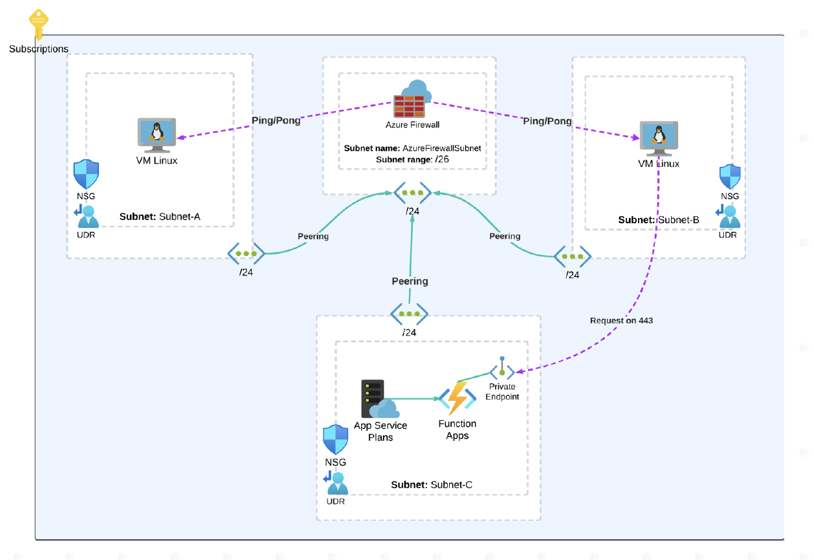

# Azure Hub-and-Spoke Architecture - Projeto Terraform Lua Cloud Consultancy


## Objetivo

Criar uma arquitetura baseada em **Hub-and-Spoke** com controle de tráfego por Azure Firewall, Function App acessível somente por rede interna via Private Endpoint, e regras rígidas de NSG + UDRs para validar conhecimento prático em IaC e redes no Azure.

---

## Infraestrutura provisionada

1 Resource Group para recursos de redes e 1 Resource Group para recursos de workload
Azure Hub-and-Spoke com 1 VNet hub e 3 VNets spokes  
Azure Firewall com regras e policies  
2 VMs Linux com ICMP permitido apenas via Firewall  
Function App com Private Endpoint acessível só via VM  
NSGs e Route Tables controlando todo o tráfego  



---

## Workflow GitHub Actions

Foi incluído um **pipeline bem simples** de CI/CD usando **GitHub Actions**, com os seguintes passos:

- `terraform init`
- `terraform fmt`
- `terraform validate`

---

## Estrutura do projeto

```bash
/
├── .github/
│   └── workflows/
│       └── terraform.yml    
├── modules/                   
│   ├── firewall/
│   ├── function_app/
│   ├── nsg/
│   ├── peering/
│   ├── private_endpoint/
│   ├── resource_group/
│   ├── route_table/
│   ├── subnet/
│   ├── vm/
│   └── vnet/
├── main.tf
├── variables.tf
├── providers.tf
├── outputs.tf
├── .gitignore
└── README.md
```

---

## Pré-requisitos

- Conta no [Microsoft Azure](https://azure.microsoft.com/)
- Azure CLI instalado (`az login`)
- Terraform >= 1.6.6
- Conta no GitHub (opcional, para usar CI/CD)

## 1. Faça login no Azure

```bash
az login
az account set --subscription "SUA_SUBSCRIPTION_ID"
```

## 2. Crie o arquivo `terraform.tfvars`

Crie um arquivo `terraform.tfvars` na raiz do projeto seguindo o `terraform.tfvars.example`

## 3. Rodar localmente com Terraform

```bash
terraform plan -var-file="terraform.tfvars"
terraform apply -var-file="terraform.tfvars"
```

---

## Justificativas técnicas

### Sem Backend Remoto / Locking
Por ser um projeto local e único, optei por manter o `terraform.tfstate` local.  
Caso seja necessário escalar ou colaborar, facilmente adicionamos um backend remoto no Azure Storage com locking e versionamento.

### Sem Workspaces ou Multi-Ambientes
Este projeto atende aos requisitos de um único ambiente de produção simulado.  
Em cenários reais, aplicaria workspaces (`dev`, `staging`, `prod`).

### Sem uso de Secrets externos
Como o deploy foi feito localmente, variáveis sensíveis não foram incluídas no GitHub Actions.  
Para ambientes reais, usaríamos **GitHub Secrets** ou **Azure Key Vault**.

---

## Tempo investido

Aproximadamente **13 horas** no total:

- 2h - Arquitetura e diagramas
- 5h - Desenvolvimento Terraform + pesquisa na documentação oficial para recursos que nunca tinha feito antes
- 1h - Adição de pipeline CI/CD, tags e outputs
- 3h - Troubleshooting com SKU das VMs, App Service Plan e assinaturas do Azure(alguns serviços só funcionavam com região e SKU específico)
- 2h - Finalização, README, .gitignore, organização e deploy no GitHub

---

## Observações finais

Agradeço pela oportunidade de participar do processo seletivo e desenvolver este projeto. Foi um desafio com muitos aprendizados e que me permitiu demonstrar conhecimentos de DevOps em Azure e Terraform.

Caso desejem elevar a solução, com separação de ambientes, integração com Key Vault, backend remoto, Azure DevOps para CI/CD, secrets e automações mais avançadas, estou totalmente disponível e preparado para adaptar e evoluir conforme as necessidades!

Muito obrigado pela entrevista e pela confiança. Estou animado com a possibilidade de contribuir com a Lua Cloud Consultancy!

**Autor:** Michel Capela - Azure DevOps Engineer
